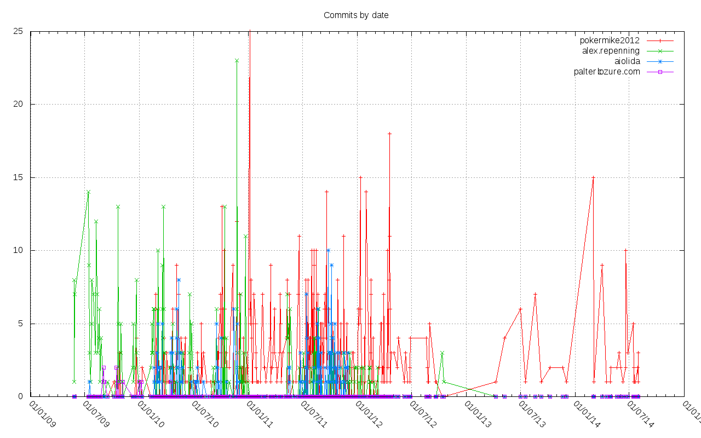
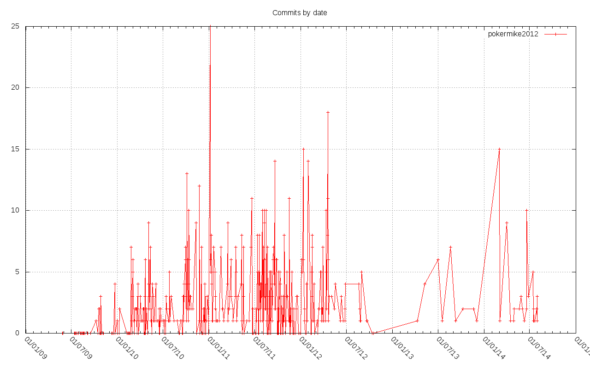
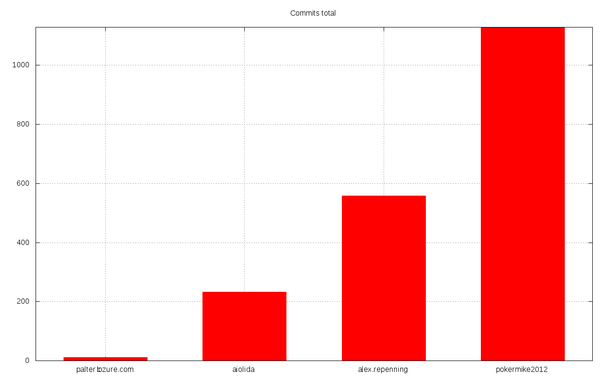

<!-- START doctoc generated TOC please keep comment here to allow auto update -->
<!-- DON'T EDIT THIS SECTION, INSTEAD RE-RUN doctoc TO UPDATE -->
**Table of Contents**

- [plotsvn](#plotsvn)
  - [Description](#description)
  - [Examples](#examples)
  - [Installation](#installation)
  - [Usage](#usage)
    - [commits-by-date](#commits-by-date)
    - [commits-total](#commits-total)
  - [Requirements](#requirements)
  - [Requirements to build](#requirements-to-build)
  - [License](#license)

<!-- END doctoc generated TOC please keep comment here to allow auto update -->

<!-- doctoc: npm install -g doctoc -->

# plotsvn

## Description

Makes some plots with GNUPlot from SVN logs.

## Examples

I took the project [xmlisp](https://code.google.com/p/xmlisp) (first lisp svn project I found on code.google.com) for the following graph examples:







I had to run the following commands to generate these graphs:

```
$ svn checkout http://xmlisp.googlecode.com/svn/trunk/ xmlisp-read-only
$ cd xmlisp-read-only/
$ svn log --xml > log.xml
$ plotsvn log.xml commits-by-date
$ plotsvn log.xml commits-by-date pokermike2012
$ plotsvn log.xml commits-total
```

## Installation

See the [requirements to build](#requirements-to-build).

```
$ make
$ sudo make install
```

## Usage

```
$ plotsvn help
```

Generally speaking, you first need to generate the XML log file from SVN. Typically, run this:

```
$ svn log --xml > log-file.xml
```

From this on, list of possible graphs:

- commits by date: shows the number of commits per date, per author
- commits total: shows the total number of commits per author

Each graph is generated in an `output.png` file.

### commits-by-date

It shows the number of commits per day, per author.

```
$ plotsvn log-file.xml commits-by-date
```

You can filter to a single author by adding its name as last argument.

```
$ plotsvn log-file.xml commits-by-date author-name
```

### commits-total

It shows the total number of commits per author.

```
$ plotsvn log-file.xml commits-total
```

## Requirements

- GNUPlot

## Requirements to build

- [sbcl][0]
- [buildapp][1]
- eventually, specify your asdf-tree in the Makefile if it's not `~/quicklisp`

## License

MIT License


  [0]: http://sbcl.org
  [1]: http://www.xach.com/lisp/buildapp/
